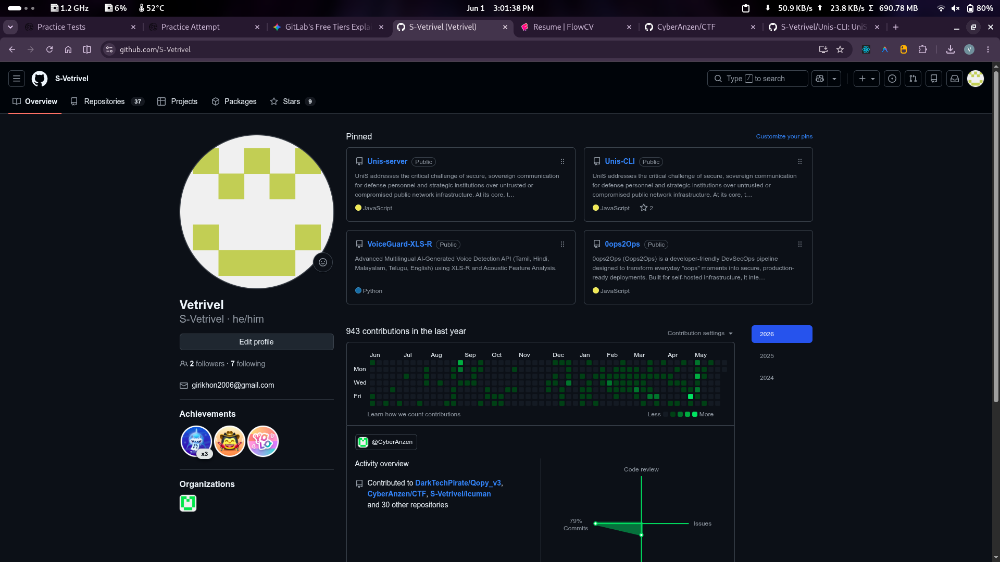
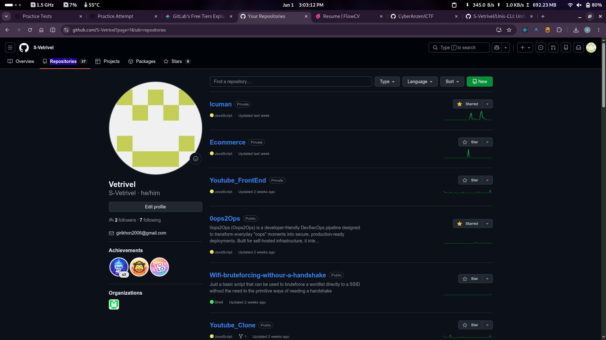

# Hi, I'm Vetrivel 👋

## 📢 Notice: Account Migration & Transparency
> **Why this account is new:** My previous GitHub account was recently flagged by an automated GitHub anti-spam system during a routine browser session. While I am actively appealing the restriction with GitHub Support, I have spun up this verified account to ensure immediate, uninterrupted access to my active history and proof of work.
>
> Below are the verified records, trackers, and repository archives from my original account.

---

### 📸 Proof of Prior Work & Activity

**Profile Overview & Analytics**
| Original Profile History | Profile Page Tracker |
| :---: | :---: |
|  |  |

**Original Repository Archives**
| Repository Overview 1 | Repository Overview 2 |
| :---: | :---: |
|  |  |
|  |  |

---

## 🛠️ Tech Stack & Focus Areas

* **Web Development:** Full-Stack MERN (MongoDB, Express.js, React, Node.js)
* **Mobile Development:** React Native Cross-Platform App Development
* **DevOps & Infrastructure:** CI/CD Pipelines, Docker Containerization, Kubernetes Orchestration
* **System Administration:** Linux System Administration & Secure Server Deployment
